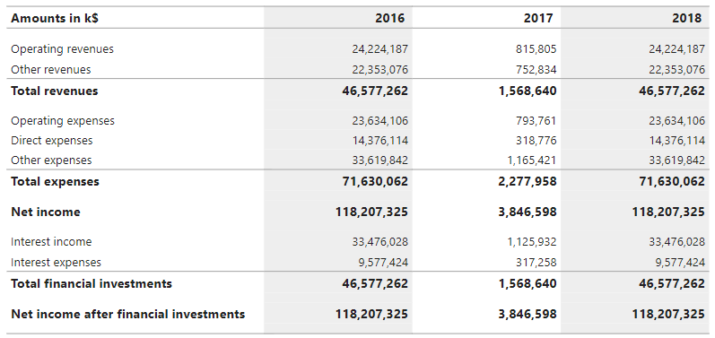
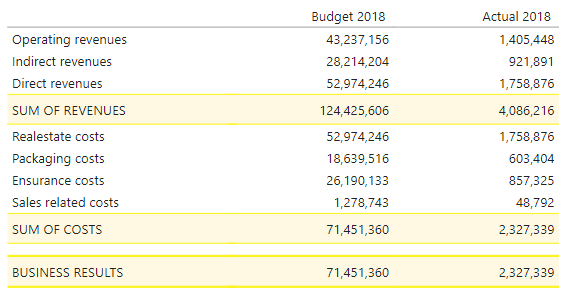

# Summary Table Power BI Custom Visual

The summary table is a custom visual that allows you to define tables in Power BI with summary rows and custom styling. The most common scenario for using this custom visual is to create the an income statement report.
* [Change Log](ChangeLog.md)



The above image shows a summary table with an income statement with two summary levels.



The abone image shows a summary table with an income statement with yellow highlighting.

## The JSON structure
```json
{
	"columns": [...],
	"rows": [...],
	"headerRow": {...},
	"displayheaderRowAllRows": true/false,
	"additionalWidth": 5, // Obsolete from version 2.0.0
	"reusableCSS" : [
		{
			"key": "#blackbackground#",
			"value": "background-color:#000;color:#fff"
		}
	],
	"masterHeader": {
		"title": "Master header of table",
		"headerStyle": "background-color:#000000;color:#fff;padding:5px",
		"borderStyle": "border:1px solid #000000"
	}	
}
```
* **additionalWidth** - additional width to add to the containing table. This property needs to be set is using borders on the columns. Add the total amount of horizontal border width to this cell.

* **reusableCSS** - a way to define a css string that is reusable in all the style properties.

* **masterHeader** - this property can be used to create a border and master header for the whole table. If no header/border are to be used, skip this property.

### Define columns - `columns`
#### Example
```json
{
	"headerStyle": "text-align:left",
	"rowStyle": "text-align:left",
	"width": 260,
	"type": "RowHeader",
	"refName": "[AccountGroup]", 
	"title": "Amounts in k$",
	"calculationFormula": "", 
	"format": ""
}
```

#### Properties
* **headerStyle** - the css style of the header of  the column.
* **rowStyle** - the css style of the row items of the column.
* **width** - the width in pixels of the column.
* **type** - the type of column. Valid values are RowHeader, Data and Calculation. RowHeader is used for the first column that contains the header for each row. Data is used for a column that is bound to a measure. Calculation is used when a specific calculation should be applied at render-time.
* **refName** - the name of the data bound measure/attribute. Only applicable when using RowHeader and Calculcation type.
* **title** - the displayed title of the column. References to measures can be done by using eval(). To reference a measure called year can be made by writing "eval([Year])".
* **calculationFormula** - the formula that should be applied when using the Calculation type. E.g. "[Savings SEK]/[Spend SEK]". Measures are referenced betweeen brackets ([]). Any formula and operator that can be evaluated using javaScript kan be used.
* **format** - the formatting that should be applied when rendered. E.g. "#,0" and "0.0 %;-0.0 %;0.0 %".

### Define rows - `rows`
#### Example
```json
{
	"title": "Total revenues",
	"formula": "[Operating revenues]+[Other revenues]",
	"rowStyle": "font-weight:bold;font-size:small;",
	"visible": true,
	"cellRowHeaderStyle": "",
	"cellRowDataStyle": "",
	"format": ""
}
```

#### Properties
* **title** - the displayed title of the row.
* **formula** - the calculation formula of the row. Either a direct reference to another row header row is used, e.g. "[Operating revenues]", or a summary formula is expressed, e.g. "[Operating revenues]+[Other revenues]". Any operator is allowed (from v1.4.0). For ranges the :: operator i used, e.g. "[100]::[200]". It is allowed to reference calculated rows is they are created before this row.
* **rowStyle** - the css style of the whole row container.
* **visible** - true or false, indicatng whether the row should be displayed or not.
* **cellRowHeaderStyle** - the css style of the row header (the first column).
* **cellRowDataStyle** - the css style of the row data columns header (all columns except the first one).
* **format** - optional formatting that should be applied to the whole row when rendered. E.g. "#,0" and "0.0 %;-0.0 %;0.0 %". 

### Define header row style - `headerRow`
#### Example
```json
"headerRow": {
	"rowStyle": "background-color:#aaa"
}
```
#### Properties
* **rowStyle** - the css style of the whole row container for the header columns.

## Known issues & limitations
* If a row calculation is used in combination with a column calculation, the row calculation is done before the column calculation.
* Hover-effects are not supported.
* Expression-based css styles are not supported (e.g. settings a background color based on an expression).
* Cross-filtering other visuals (by clicking on a row) is not supported.
